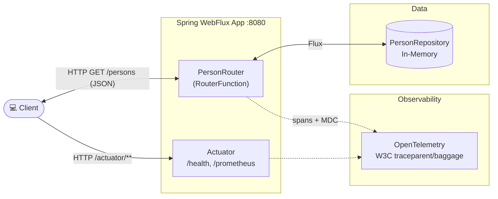

# Spring Framework 6: Beginner to Guru — Spring 6 Reactive Examples

Spring Boot 4 / Spring Framework 6 **WebFlux** example application. Exposes a small reactive `Person`
API via a functional `RouterFunction`, backed by an in-memory repository, with Actuator/Prometheus
metrics and OpenTelemetry tracing.

## Architecture Overview



## Build & Test

```bash
./mvnw clean verify          # format check, unit (*Test) + IT (*IT) tests, JaCoCo, Helm lint/template
./mvnw clean install         # verify + local Docker image + Helm package (target/helm/repo/)
./mvnw test                  # unit tests only (surefire, *Test)
./mvnw verify                # integration tests only (failsafe, *IT)
./mvnw test -Dtest=PersonRepositoryImplTest             # single test class
./mvnw test -Dtest=PersonRepositoryImplTest#findById    # single test method
./mvnw spotless:apply        # auto-fix pom/markdown/json/yaml/shell formatting
./mvnw spring-javaformat:apply                          # auto-fix Java code style
```

> Formatting is enforced at build time (`validate` phase). Run both `spotless:apply` and
> `spring-javaformat:apply` before committing if the build fails there.

## API

| Method |          Path          |          Description          |
|--------|------------------------|-------------------------------|
| GET    | `/persons`             | all persons (in-memory)       |
| GET    | `/actuator`            | Actuator endpoint index       |
| GET    | `/actuator/health`     | health / readiness / liveness |
| GET    | `/actuator/prometheus` | Prometheus metrics            |

Local: http://localhost:8080 — Kubernetes (NodePort): http://node-ip:30080

The `restRequest/` folder contains IntelliJ HTTP Client request files (`rest.http`,
`actuator.http`), including `traceparent`/`baggage` headers for manual trace testing.

## Running Locally

```bash
./mvnw spring-boot:run
```

## Sandbox (local dev environment)

The sandbox is provisioned by the opencode-sandbox-kit and runs as a Docker container. It mounts this
repo, starts the agent, and connects the IntelliJ MCP server.

Allow the kit source (GitHub without cloning):

```powershell
sbx settings set kit.allowedSources --% "[\"docker.io/\",\"github.com/dboeckli/\"]"
```

Start a new sandbox:

```powershell
sbx run opencode `
    --kit "git+https://github.com/dboeckli/opencode-sandbox-kit.git#dir=opencode-agent" `
    --template docker/sandbox-templates:opencode-docker-0.5.0 `
    --no-share-skills `
    --static-mcp idea `
    . `
    "C:\development\maven-repo:ro"
```

Start the sandbox with Kubernetes support:

```powershell
sbx run opencode `
    --kit "git+https://github.com/dboeckli/opencode-sandbox-kit.git#dir=opencode-agent" `
    --template docker/sandbox-templates:opencode-docker-0.5.0 `
    --no-share-skills `
    --static-mcp idea `
    . `
    "C:\development\maven-repo:ro" `
    "$env:USERPROFILE\.kube:ro"
```

Claude variant (Home):

```powershell
sbx run claude `
    --kit "git+https://github.com/dboeckli/opencode-sandbox-kit.git#dir=opencode-agent" `
    --template docker/sandbox-templates:claude-code-docker-0.5.0 `
    --no-share-skills `
    --static-mcp idea `
    . `
    "C:\development\maven-repo:ro"
```

Mammouth (template pin lives in the spec image):

```powershell
sbx run "git+https://github.com/dboeckli/opencode-sandbox-kit.git#dir=mammouth-agent" `
    --no-share-skills `
    --static-mcp idea `
    . `
    "C:\development\maven-repo:ro"
```

Apply the kit to an existing sandbox (restarts the sandbox, VM state is kept):

```powershell
sbx kit add <sandbox-name> "git+https://github.com/dboeckli/opencode-sandbox-kit.git#dir=opencode-agent"
```

> **Sandbox quirk:** Before any `./mvnw` in the sandbox run `export npm_config_bin_links=false`
> (Spotless/prettier otherwise fails with EPERM on the mounted workspace).

## Kubernetes

Deployment is Helm-only into the **`spring-6-reactive-examples`** namespace.

### Deploy with Helm

After `./mvnw clean install`, the packaged chart is placed in `target/helm/repo/`.

```powershell
cd target/helm/repo

$file = Get-ChildItem -Filter spring-6-reactive-examples-chart-*.tgz | Select-Object -First 1
tar -xvf $file.Name

$APPLICATION_NAME = Get-ChildItem -Directory | Where-Object { $_.LastWriteTime -ge $file.LastWriteTime } | Select-Object -ExpandProperty Name
helm upgrade --install $APPLICATION_NAME ./$APPLICATION_NAME --namespace spring-6-reactive-examples --create-namespace --wait --timeout 5m --debug --render-subchart-notes
```

### Helm Operations

```powershell
# List pods
kubectl get pods -n spring-6-reactive-examples

# Logs (replace $POD with a pod name from the command above)
kubectl logs $POD -n spring-6-reactive-examples --all-containers

# Describe a pod ($POD_NAME: spring-6-reactive-examples)
kubectl describe pod $POD_NAME -n spring-6-reactive-examples

# Show endpoints
kubectl get endpoints -n spring-6-reactive-examples

# Helm status / test / uninstall
helm status    $APPLICATION_NAME --namespace spring-6-reactive-examples
helm test      $APPLICATION_NAME --namespace spring-6-reactive-examples --logs
helm uninstall $APPLICATION_NAME --namespace spring-6-reactive-examples

# Remove all resources in the namespace
kubectl delete all --all -n spring-6-reactive-examples
```

### Debugging in Kubernetes

Spawn a temporary BusyBox shell for in-cluster diagnostics:

```powershell
kubectl run busybox-test --rm -it --image=busybox:1.36 --namespace=spring-6-reactive-examples --command -- sh
```

Use the actuator endpoint to verify the application is healthy via NodePort **30080**.
